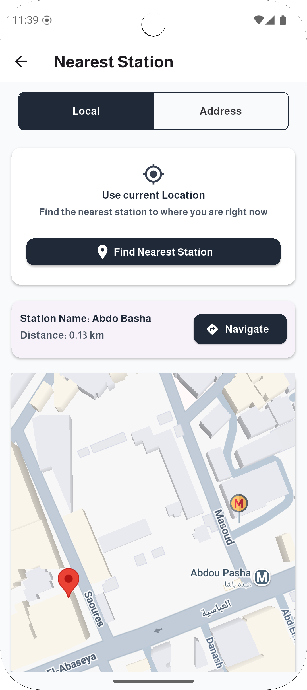
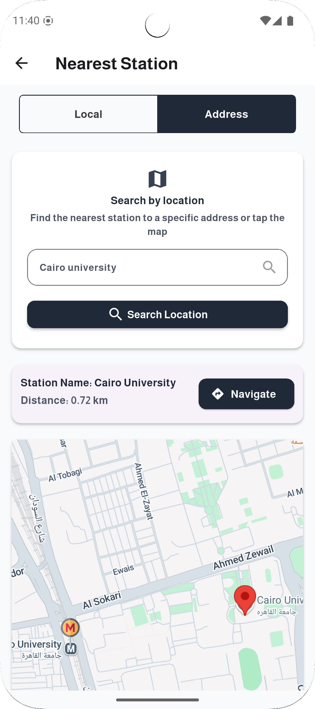
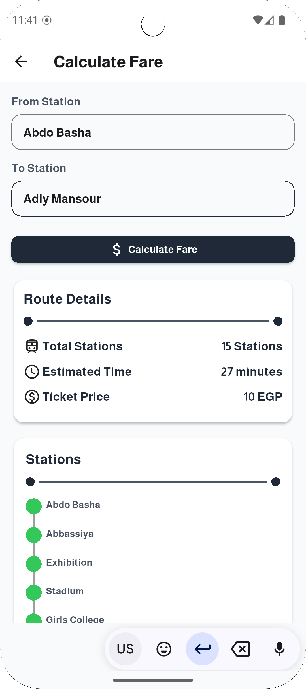
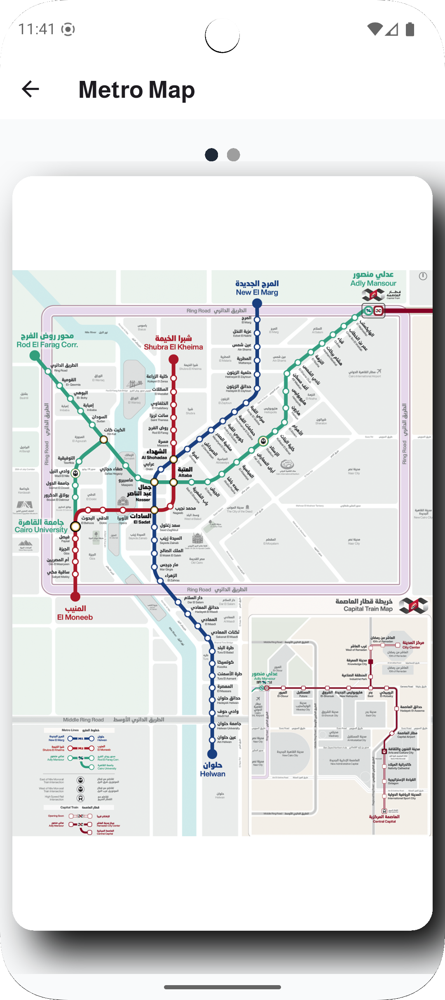
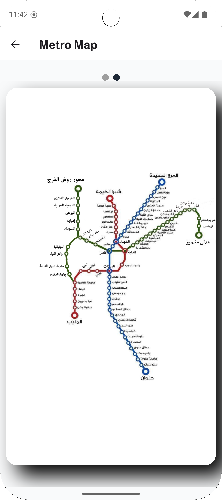

# 🚇 Metro Scout

Metro Scout is a Flutter app designed to help users navigate the metro system in Cairo with ease. Whether you're trying to find the nearest station, calculate your fare, or explore the metro map — Metro Scout has got you covered.

## 📲 Features

- 🔍 **Find Nearest Station**
  - Automatically locate the closest metro station using your current location.
     
  
  
  - locate the closest metro station usings searched address or taping the map.
    
  

- 💸 **Fare Calculator**
  - Choose your starting and destination stations to calculate ticket prices and trip details.
    
  

- 🗺️ **Interactive Metro Map**
  - View the complete Cairo metro network map, zoomable and swipeable with smooth animations.
     
    
    &nbsp; &nbsp; &nbsp;&nbsp;&nbsp;&nbsp;&nbsp;
    
    
- 🌐 **Multi-language Support**
  - Available in both English and Arabic.
  
## ⚙️ Tech Stack

- **Language:** Dart / Flutter
- **Architecture:** BLoC / Cubit
- **State Management:** flutter_bloc
- **Database:** (Drift / SQLite)
- **Packages Used:**
  - `google_maps_flutter`
  - `geolocator`
  - `geocoding`
  - `flutter_localizations`
  - `smooth_page_indicator`
  - `flutter_animate`

## 📥 APK
📥 Download Demo APK: [Google Drive Link](https://drive.google.com/drive/folders/1VY8vFmdAzZCx4xbgHBOU5KKOaUpSBqhH?usp=drive_link)
